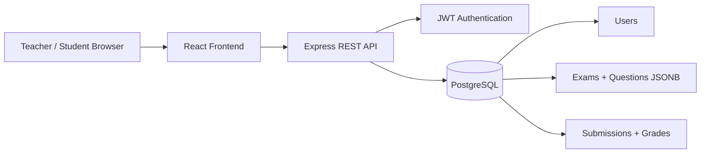
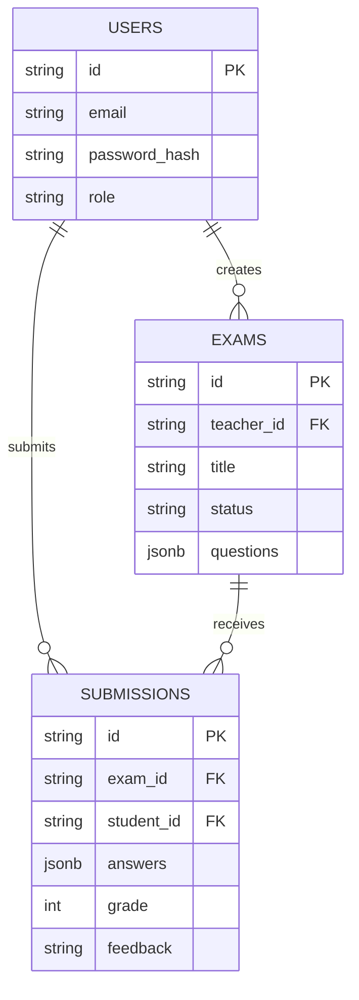
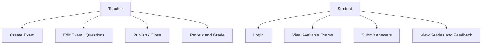

# Visual Diagrams for Presentation

## Architecture

```mermaid
flowchart LR
  Browser[Teacher / Student Browser] --> React[React Frontend]
  React --> API[Express REST API]
  API --> JWT[JWT Authentication]
  API --> DB[(PostgreSQL)]
  DB --> Users[Users]
  DB --> Exams[Exams + Questions JSONB]
  DB --> Submissions[Submissions + Grades]
```

## Database ERD

```mermaid
erDiagram
  USERS ||--o{ EXAMS : creates
  USERS ||--o{ SUBMISSIONS : submits
  EXAMS ||--o{ SUBMISSIONS : receives
  USERS { string id PK string email string password_hash string role }
  EXAMS { string id PK string teacher_id FK string title string status jsonb questions }
  SUBMISSIONS { string id PK string exam_id FK string student_id FK jsonb answers int grade string feedback }
```

## Use Cases

```mermaid
flowchart TB
  Teacher --> Create[Create Exam]
  Teacher --> Edit[Edit Exam / Questions]
  Teacher --> Publish[Publish / Close]
  Teacher --> Review[Review and Grade]
  Student --> Login
  Student --> Available[View Available Exams]
  Student --> Submit[Submit Answers]
  Student --> Results[View Grades and Feedback]
```
