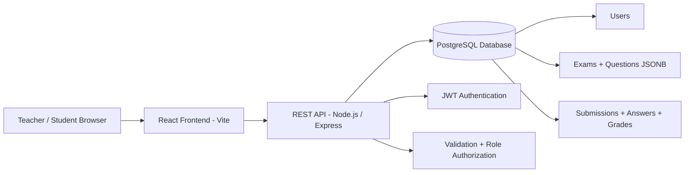
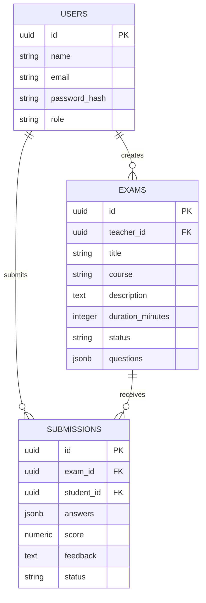
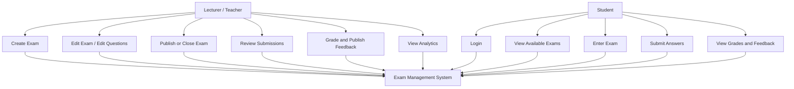
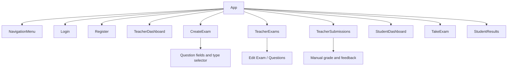

# Visual Diagrams for Final Presentation

Use these diagrams in the final presentation. They can be copied into tools that support Mermaid diagrams, or redrawn as boxes/arrows in PowerPoint.

## 1. Architecture Diagram

## 2. Database ERD

## 3. Use Case Diagram

## 4. Frontend Component Hierarchy

